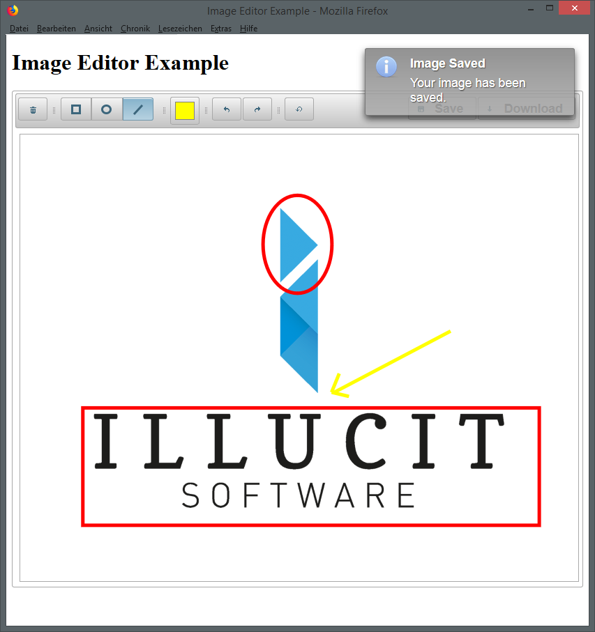

ImageEditor Component for PrimeFaces
====================================

About
-----

This package provides a JSF (Java Server Faces) component *ImageEditor* as addition to the
commonly used [PrimeFaces](http://www.primefaces.org) widget library.

**Authors**: Christian Simon <[simon@illucit.com](mailto:simon@illucit.com)>, Daniel Wieth <[wieth@illucit.com](mailto:wieth@illucit.com)>  
**Copyright**: illucIT Software GmbH  
**URL**: [www.illucit.com](https://www.illucit.com)  
**License**: [The Apache License, Version 2.0](http://www.apache.org/licenses/LICENSE-2.0.txt)  
**Current Version**: 2.0.0

Compatibility:
--------------

*ImageEditor* is written for and tested with **PrimeFaces 6.2** and **JSF 2.3** (also backwards compatible to JSF 2.2).
Due to changes in the PrimeFaces API for streamed data, the library is not compatible with earlier PrimeFaces versions without modifications.

Example
-------

There is an example project that shows the usage of the ImageEditor components:
[illucIT/primefaces-imageeditor-example](https://github.com/illucIT/primefaces-imageeditor-example)

Setup
-----

The *ImageEditor*  component can either be downloaded directly on GitHub or included via Maven.

Then just add the Maven artifact to your dependencies:

	<dependencies>
		<dependency>
			<groupId>com.illucit</groupId>
			<artifactId>primefaces-imageeditor</artifactId>
			<version>${version.imageeditor}</version>
		</dependency>
	<dependencies>

Usage in JSF
------------

The library provides a taglib including the `imageEditor` component.
In order to use the component, first declare a namespace for the taglib in your JSF source file (where your also would include the namespace for PrimeFaces):

	<html xmlns="http://www.w3.org/1999/xhtml" lang="en"
		...
		xmlns:p="http://primefaces.org/ui"
		xmlns:ie="http://www.illucit.com/jsf/imageeditor">

Then you can use the `imageEditor` tag in your facelet file.

	<ie:imageEditor id="exampleImageEditor" widgetVar="imageEd"
		value="#{imageEditorBean.image}" initialColor="ffff00"
		initialShape="ellipse"
		fileUploadListener="#{imageEditorBean.onImageSaved}"
		labelSave="Save" labelDownload="Download"
		onsuccess="alert('Successfully saved!');">
		<f:param name="fileName" value="#{imageEditorBean.fileName}" />
	</ie:imageEditor>

The following parameters are required for the `imageEditor` component to work correctly:
* `value`: Expression of a method returing a `StreamedContent` object containing the image data.
Every parameter child element of type `<f:param />` will be attached to the image request.  
Note: As the image is requested by a normal GET request, no view scope can be used for this as the view id will not be transmitted.
* `fileUploadListener`: Bean method accepting an `ImageEditedEvent` object.
The method is called when the save button is pressed. The given object contains the binary image data.

Usage with other PrimeFaces versions
------------------------------------

If you want to use the ImageEditor component with another PrimeFaces version than the one in the dependency, you can
exclude the PrimeFaces dependency via maven and provide your own. This is especially useful, if you have access to the
PrimeFaces Elite releases, which contain additional fixes and features, but are compatible with the main branch.

	<dependency>
        <groupId>com.illucit</groupId>
        <artifactId>primefaces-imageeditor</artifactId>
        <version>${version.imageeditor}</version>
        <exclusions>
            <exclusion>
                <groupId>org.primefaces</groupId>
                <artifactId>primefaces</artifactId>
            </exclusion>
        </exclusions>
    </dependency>

    <dependency>
        <groupId>org.primefaces</groupId>
        <artifactId>primefaces</artifactId>
        <version>${newer.primefaces.version}</version>
    </dependency>

Disclaimer:
-----------

ImageEditor is free software and comes with NO WARRANTY!
